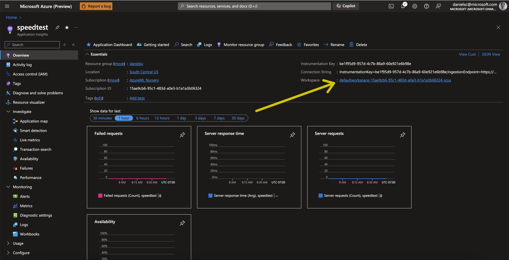
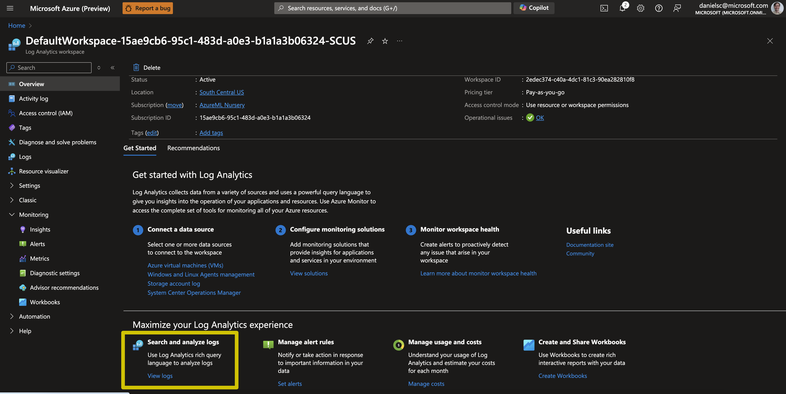
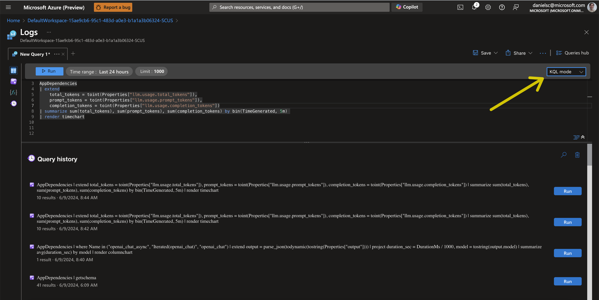
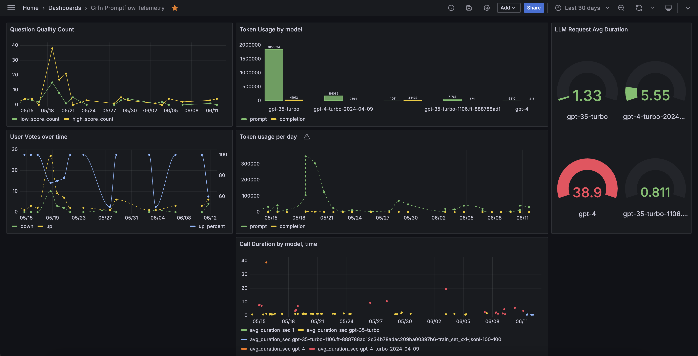
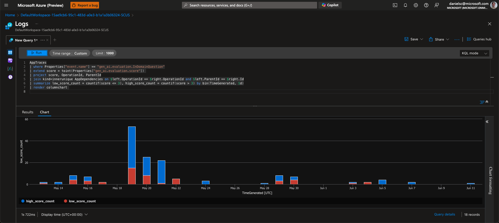

## Application Insights / Azure Monitor 

This demo is set up to view your telemetry in Application Insights / Azure Monitor both to capture the Open Telementry traces as well as evaluation of those traces (both by humans and by automated evaluation).

> Note: The way that LLM executions are captured in Open Telemetry, aka the semantic conventions, are still in development by the Open Telemetry community (see [here for the project that is tracking this](https://github.com/open-telemetry/community/blob/main/projects/llm-semconv.md)). The property names and structure used in this demo are based on the current best practices and are guaranteed to change as the OpenAI Semantic Conventions for LLMs are finalized.

### View traces in Application Insights

In addition to the Promptflow Tracing UI, you can also view the traces in Application Insights. You already set the environment variable `APPLICATIONINSIGHTS_CONNECTION_STRING` in the `.env` file. The value should be the **connection string** of the Application Insights instance you want to use.


To see the traces here, you can for instance use the End-to-End transaction details view in Application Insights. To get there, follow the clicks as shown in the image below:


Which will give you a view like this:


### Building a Dashboard with Promptflow Telemetry

> Note: You can access the telemetry data both through the Application Insights instance and the associated Log Analytics Workspace, albeit using different table and column names (see [here for details](https://learn.microsoft.com/en-us/azure/azure-monitor/app/convert-classic-resource#table-structure)). We are choosing access through the Log Analytics Workspace since it is the recommended way for new projects and it allows Python access to the data which we will be using to create automated evaluations.

To have the Telemetry from Promptflow and your app show up in and Azure Portal Dashboard or a Grafana Dashboard, you can follow these steps:

1. Navigate to the Log Analytics Workspace: In App Insights, got to Overview page and click on the Workspace link:


2. Under **Maximize your Log Analytics experience**, click on **View logs**:


3. In the Logs view, create a new query. Make sure to edit your query in KQL Mode so you have access to the different tables.



Here is an example of a query that shows the tokens used over time: 

```kql
AppDependencies
| extend
    total_tokens = toint(Properties["llm.usage.total_tokens"]),
    prompt_tokens = toint(Properties["llm.usage.prompt_tokens"]),
    completion_tokens = toint(Properties["llm.usage.completion_tokens"])
| summarize sum(total_tokens), sum(prompt_tokens), sum(completion_tokens) by bin(TimeGenerated, 5m) 
| render timechart
```


4. Save the query and pin it to a dashboard. You can create a new dashboard or add it to an existing one.


5. Once pinned to the Dashboard, you can edit the title and move/resize the chart as you see fit.


To manage your Azure Portal Dashboards, got to the Dashboard hub in the Azure Portal:


Here are a few KQL queries that you can use to get started with building your own dashboards:

> Note: As mentioned above, the property names and structure used in this demo are based on the current best practices and are guaranteed to change as the OpenAI Semantic Conventions for LLMs are finalized.

- Average duration of OpenAI Chat calls model and time:
```kql
AppDependencies
| where Name in ("openai_chat_async", "Iterated(openai_chat)", "openai_chat")
| extend model = substring(tostring(Properties["llm.response.model"]), 0, 30),
         duration_sec = DurationMs / 1000
| summarize avg(duration_sec) by bin(TimeGenerated, 1h), model
| order by TimeGenerated asc 
| render timechart 
```

- Average duration of OpenAI Chat calls by model:
```kql
AppDependencies
| where Name in ("openai_chat_async", "Iterated(openai_chat)", "openai_chat")
| extend model = substring(tostring(Properties["llm.response.model"]), 0, 30)
| project duration_sec = DurationMs / 1000, model 
| summarize avg(duration_sec) by model
| render columnchart
```

- Average duration of Assistant Runs by model:
```kql
AppDependencies
| where Name in ("AssistantAPI.run")
| extend model = substring(tostring(Properties["llm.response.model"]), 0, 30)
| where model != ""
| project duration_sec = DurationMs / 1000, model 
| summarize avg(duration_sec) by model
| render columnchart
```

- Tokens used by model over time:
```kql
AppDependencies
| where Name in ("openai_chat_async", "Iterated(openai_chat)", "openai_chat", "AssistantAPI.run")
| extend
    total_tokens = toint(Properties["llm.usage.total_tokens"]),
    prompt_tokens = toint(Properties["llm.usage.prompt_tokens"]),
    completion_tokens = toint(Properties["llm.usage.completion_tokens"]),
    model = substring(tostring(Properties["llm.response.model"]), 0, 22)
| where model != ""    
| summarize prompt = sum(prompt_tokens), completion = sum(completion_tokens) by model
| render columnchart 
```

- Total tokens used by model/deployment
```kql
AppDependencies
| where Name in ("openai_chat_async", "Iterated(openai_chat)", "openai_chat", "AssistantAPI.run")
| extend
    total_tokens = toint(Properties["llm.usage.total_tokens"]),
    prompt_tokens = toint(Properties["llm.usage.prompt_tokens"]),
    completion_tokens = toint(Properties["llm.usage.completion_tokens"]),
    model = substring(tostring(Properties["llm.response.model"]), 0, 30)
| summarize prompt = sum(prompt_tokens), completion = sum(completion_tokens) by model
| render columnchart 
```


- User votes over time:
```kql
AppTraces
| where Properties["event.name"] == "gen_ai.evaluation.user_vote"
| extend vote = toint(Properties["gen_ai.evaluation.vote"]) 
| project vote, OperationId, ParentId
| join kind=innerunique AppDependencies on $left.OperationId == $right.OperationId and $left.ParentId == $right.Id
| summarize down = countif(vote == 0), up = countif(vote == 1), up_percent = 100*avg(vote) by bin(TimeGenerated, 1d)
| render timechart  
```

- Question Quality over time:
```kql
AppTraces
| where Properties["event.name"] == "gen_ai.evaluation.InDomainQuestion"
| extend score = toint(Properties["gen_ai.evaluation.score"]) 
| project score, OperationId, ParentId
| join kind=innerunique AppDependencies on $left.OperationId == $right.OperationId and $left.ParentId == $right.Id
| summarize low_score_count = countif(score <= 3), high_score_count = countif(score > 3) by bin(TimeGenerated, 1d)
| render timechart 
```

Here an example of a Grafana dashboard with the above queries:



### Query the data in Azure Data Explorer
In addition to the Azure UX for the Azure Log Analytics workspace, and you can query the data from Azure Data Explorer (ADE) by follwing these steps:

1. go to https://dataexplorer.azure.com/ and add a connection:


Then add the URL for you App Insights instance like so:


Following this format:
`https://ade.loganalytics.io/subscriptions/<subscription-id>/resourcegroups/<resource-group-name>/providers/microsoft.operationalinsights/workspaces/<workspace-name>`

This will allow you to execute the same queries as above but in a more developer-friendly fronted. You can then take them back to Azure Monitor or Grafana and pin them to a Dashboard.

In addition, you can pull data from App Insights to build datasets for validation and fine tuning. For instance, in our example the sub-flow that provides the sales data insights is called `SalesDataInsights`. That means that you will find traces with that name from which you can retrieve the input and output parameters with a query like this:

```kql
AppDependencies
| where Name == "SalesDataInsights" 
| extend inputs = parse_json(tostring(Properties.inputs)),
         output = parse_json(tostring(Properties.output))
| project question = inputs.question, query = output.query, error = output.error
```

This will allow you to export the data to a CSV and then use for tasks like human evaluation or fine tuning.


### Programmatic access of telementry data

Azure Monitor / Log Analytics also allows prgrammatic access to you telemetry data by executing KQL queries in Python (and other languages). To access the data you will need the GUID of the Log Analytics Workspace which you can get from the Overview page:


Here is an example of how to execute a query on a Log Analytics Workspace using that `workspace_id`:

```python
import os
import pandas as pd
from datetime import datetime, timezone, timedelta
from azure.monitor.query import LogsQueryClient, LogsQueryStatus
from azure.identity import DefaultAzureCredential
from azure.core.exceptions import HttpResponseError

credential = DefaultAzureCredential()
client = LogsQueryClient(credential)
workspace_id="********-****-****-****-**********" 

query = f"""
AppDependencies
| where Name == "SalesDataInsights" 
| extend inputs = parse_json(tostring(Properties.inputs)),
         output = parse_json(tostring(Properties.output))
| project question = inputs.question, query = output.query, error = output.error
"""

end_time=datetime.now(timezone.utc)
start_time=end_time - timedelta(days=1)

try:
    response = client.query_workspace(
        workspace_id=workspace_id,
        query=query,
        timespan=(start_time, end_time)
        )
    if response.status == LogsQueryStatus.PARTIAL:
        error = response.partial_error
        data = response.partial_data
        print(error)
    elif response.status == LogsQueryStatus.SUCCESS:
        data = response.tables
    for table in data:
        df = pd.DataFrame(data=table.rows, columns=table.columns)
        
except HttpResponseError as err:
    print("something fatal happened")
    print(err)

print(df)
```

### Automatic Evaluations

This demo provides a way to run evaluations against the telemetry collected. The result of the evaluation is then written back to the Application Insights instance as an open telemetry event (i.e. to the AppTraces table) to the relevant span, allowing you to query it through KQL and visualizing it in your dashboards.

The script requires the following environment variables to be set (e.g. in `.env`):
- `OPENAI_API_BASE`, `OPENAI_API_KEY`, `OPENAI_API_VERSION`, `OPENAI_EVAL_MODEL`: The model configuration to be used to execute the evaluation prompty.
- `LOG_ANALYTICS_WORKSPACE_ID`: The GUID of your log analytics workspace (to read the telemetry from) -- see above
- `APPLICATIONINSIGHTS_CONNECTION_STRING`: The App Insights connection string (to write the evaluation events back) -- see above

To execute the script with defaults just run:
```bash
python src/evaluate/azure_monitor/eval_azure_monitor.py
```

By default, the command will run the [in_domain_evaluator.prompty](src/custom_evaluators/in_domain_evaluator.prompty) over the output of this kql query (saved in [sales_data_insights.kql](src/evaluate/azure_monitor/sales_data_insights.kql)):

```kql
AppDependencies
| where Name == "SalesDataInsights" 
| extend inputs = parse_json(tostring(Properties.inputs)),
         output = parse_json(tostring(Properties.output)),
         hash = hash(OperationId, 2)                            // select 1 in 2 traces
| where hash==0
| project question = inputs.question, query = output.query, error = output.error, trace_id = OperationId, span_id = Id, time_stamp = TimeGenerated
| order by time_stamp asc
```

The above query will return the input and output of spans of 50% of the traces (1 out of every 2) for the `SalesDataInsights` sub-flow along with the `trace_id`, `span_id` and `time_stamp` fields. The `trace_id` and `span_id` are used to write the evaluation results back to the App Insights instance as events under the respective span. The `time_stamp` is used to keep track of the last timestamp processed by the script, so subsequent exections won't process the same spans again.

To run with different evaluator, you can pass the path to the promtpy file as an argument to the script. **As you do that, make sure to also change the timestamp file to a new one to start from scratch.** Here is the usage of the script:

```bash
usage: eval_azure_monitor.py [-h] [--kql-file KQL_FILE] [--timestamp-file TIMESTAMP_FILE] [--evaluator-path EVALUATOR_PATH] [--dry-run]

Evaluate Azure Monitor data

options:
  -h, --help            show this help message and exit
  --kql-file KQL_FILE   KQL query file. Default is sales_data_insights.kql
  --timestamp-file TIMESTAMP_FILE
                        Timestamp file. Default is in_domain_evaluator_time_stamp.txt
  --evaluator-path EVALUATOR_PATH
                        Evaluator path. Currently only prompty is supported. Default is in_domain_evaluator.prompty
  --dry-run             When set, the script will not write to App Insights. Default is False.
```

To view the evaluation results in a dashboard, you can use the following query:

```kql
AppTraces
| where Properties["event.name"] == "gen_ai.evaluation.InDomainQuestion"
| extend score = toint(Properties["gen_ai.evaluation.score"]) 
| project score, OperationId, ParentId
| join kind=innerunique AppDependencies on $left.OperationId == $right.OperationId and $left.ParentId == $right.Id
| summarize low_score_count = countif(score <= 3), high_score_count = countif(score > 3) by bin(TimeGenerated, 1d)
| render columnchart 
```


(you might need to set the visualization to stacked column chart under "Chart Formatting" to get this view)

Enjoy exploring your Promptflow telemetry!

