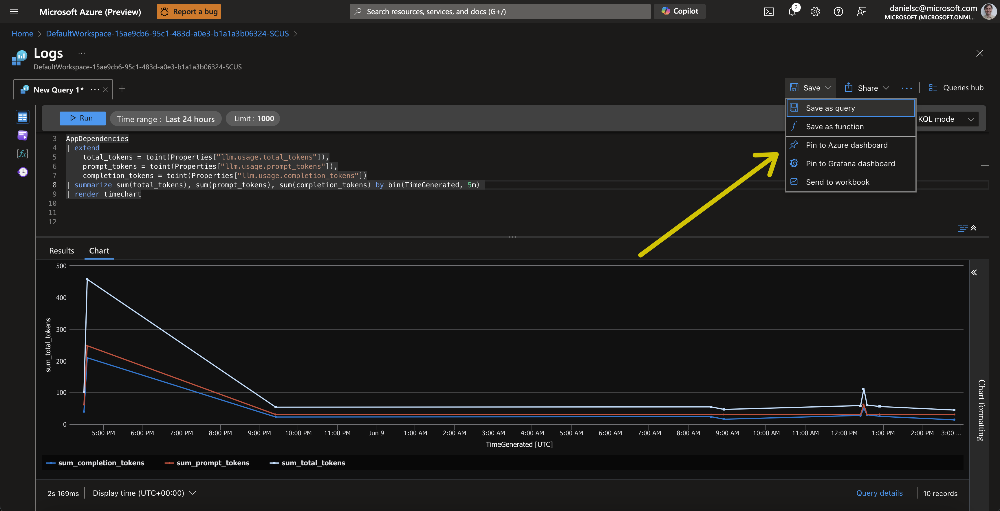
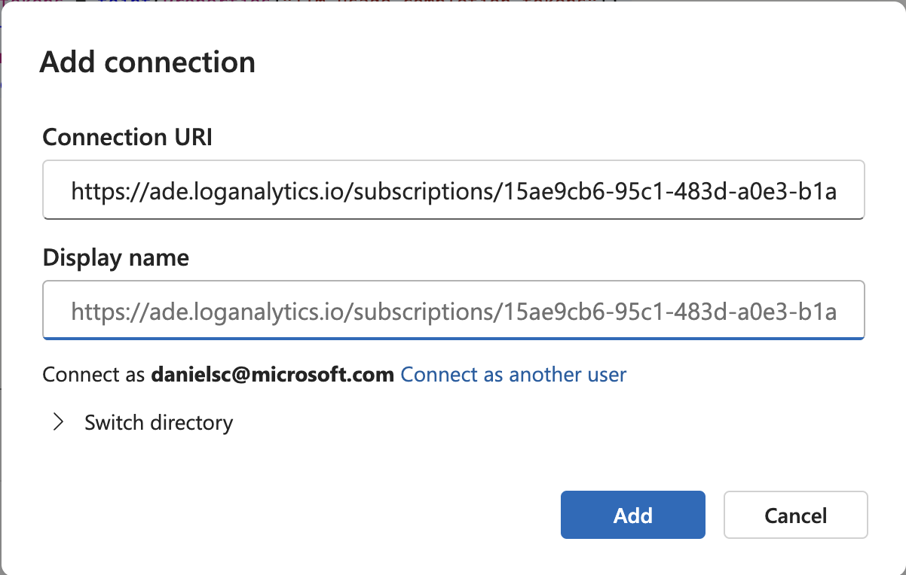

# Project

## Tracing function calls

In this sample, we will show how to use [Azure OpenAI Assistants](https://learn.microsoft.com/en-us/azure/ai-services/openai/how-to/assistant) with [Prompt Flow](https://microsoft.github.io/promptflow/).

### Prerequisites:

- Python 3.11
- Conda
- AI Studio Hub & Project with an Azure OpenAI endpoint (**OPENAI_API_BASE**, **OPENAI_API_KEY**) in a [region that supports assistants](https://learn.microsoft.com/en-us/azure/ai-services/openai/concepts/models#assistants-preview) with an 1106 model or better -- I recommend creating it in Sweden central. 
- Deployments of OpenAI models:
    - deployment of `gpt-4-1106-preview`/`gpt-35-turbo-1106` or later for use by the **OpenAI assistant**. Both work, but `gpt-35-turbo-1106` is faster and `gpt-4-1106-preview` is more accurate. (**OPENAI_ASSISTANT_MODEL**)
    - deployment of `gpt-35-turbo-1106` or later for use by the **Data Analyst** to perform some limited NL to SQL. (**OPENAI_ANALYST_CHAT_MODEL**)
- Azure Application Insights (**APPINSIGHTS_CONNECTION_STRING**)

Copy `.env.sample` to `.env` and fill in the values:

```bash
OPENAI_API_TYPE="azure"
OPENAI_API_VERSION="2024-02-15-preview"
OPENAI_API_BASE="https://***.openai.azure.com/"
OPENAI_API_KEY="******************"
OPENAI_ASSISTANT_MODEL="gpt-35-turbo-1106"
OPENAI_ANALYST_CHAT_MODEL="gpt-35-turbo-1106"
OPENAI_ASSISTANT_ID="asst_0leWabwuOmzsNVG5Kst1CpeV" <-- you will create this further down
APPINSIGHTS_CONNECTION_STRING="InstrumentationKey=***;IngestionEndpoint=https://****.in.applicationinsights.azure.com/;LiveEndpoint=https://****"
```

### Install dependencies

```bash
conda env create -f environment.yml
conda activate assistant
```

Then install the pre-release version of azure-monitor-opentelemetry-exporter
```bash
pip install azure-monitor-opentelemetry-exporter --pre
```

### Create an OpenAI assistant

Create an OpenAI assistant using the setup.py script

```bash
python src/assistant_flow/setup.py
```

This should ouput something like this:

```log
OPENAI_API_KEY ******
OPENAI_API_BASE https://******.openai.azure.com
OPENAI_API_VERSION 2024-02-15-preview
{'id': 'asst_wgEXCRBQ7E4BfznSkGgJy41k', 'created_at': 1714610540, 'description': None, 'instructions': "\nYou are a helpful assistant that helps the user potentially with the help of some functions.\n\nIf you are using multiple tools to solve a user's task, make sure to communicate \ninformation learned from one tool to the next tool.\nFirst, make a plan of how you will use the tools to solve the user's task and communicated\nthat plan to the user with the first response. Then execute the plan making sure to communicate\nthe required information between tools since tools only see the information passed to them;\nThey do not have access to the chat history.\nIf you think that tool use can be parallelized (e.g. to get weather data for multiple cities) \nmake sure to use the multi_tool_use.parallel function to execute.\n\nOnly use a tool when it is necessary to solve the user's task. \nDon't use a tool if you can answer the user's question directly.\nOnly use the tools provided in the tools list -- don't make up tools!!\n\nAnything that would benefit from a tabular presentation should be returned as markup table.\n", 'metadata': {}, 'model': 'gpt-35-turbo-1106', 'name': 'Contoso Assistant', 'object': 'assistant', 'tools': [{'type': 'code_interpreter'}, {'function': {'name': 'sales_data_insights', 'description': '\n            get some data insights about the contoso sales data. This tool has information about total sales, return return rates, discounts given, etc., by date, product category, etc.\n            you can ask questions like:\n            - query for the month with the strongest revenue\n            - which day of the week has the least sales in january\n            - query the average value of orders by month\n            - what is the average sale value for Tuesdays\n            If you are unsure of the data available, you can ask for a list of categories, days, etc.\n            - query for all the values for the main_category\n            If a query cannot be answered, the tool will return a message saying that the query is not supported. otherwise the data will be returned.\n            ', 'parameters': {'type': 'object', 'properties': {'question': {'type': 'string', 'description': "The question you want to ask the tool in plain English. e.g. 'what is the average sale value for Tuesdays'"}}, 'required': ['question']}}, 'type': 'function'}], 'response_format': None, 'temperature': None, 'tool_resources': None, 'top_p': None, 'file_ids': []}
Assistant created with id asst_wgEXCRBQ7E4BfznSkGgJy41k
add the following to your .env file
OPENAI_ASSISTANT_ID="asst_wgEXCRBQ7E4BfznSkGgJy41k"
```

You should go to your Azure AI Studio project and check that the assistant was actually created -- it should look like this:


Then do as suggested on the console by adding the provided line `OPENAI_ASSISTANT_ID="asst_*****"` to the `.env` file.

### Test the Assistant Flow

You can test that the flow is working correctly by running the following command:

```bash
pf flow test --flow src/assistant_flow --ui
```

This will start the prompt flow service (pfs) and provide a URL to the chat UI. The console output will be similar to this:

```log
Prompt flow service has started...
You can begin chat flow on http://127.0.0.1:23333/v1.0/ui/chat?flow=L1VzZXJzL2RhbmllbHNjL2dpdC9hc3Npc3RhbnQtcGYtZGVtby9zcmMvYXNzaXN0YW50X2Zsb3cvZmxvdy5kYWcueWFtbA%3D%3D
```

You can ask the assistant questions like: 
> get the order numbers by month for the last year and plot it in a line chart using matplotlib. Make use to use the month names in the plot.

### Run the Chainlit sample app

The sample app uses [chainlit](https://docs.chainlit.io/get-started/overview) to build a simple chat UI that is capable of displaying images. The app is started like so:

```bash
python src/app.py
```

The console output will be similar to this (port numbers might differ):

```bash
2024-05-01 20:49:19 - Loaded .env file
2024-05-01 20:49:21 - collection: assistant-test
2024-05-01 20:49:21 - resource attributes: {'service.name': 'promptflow', 'collection': 'assistant-test'}
2024-05-01 20:49:21 - tracer provider is set with resource attributes: {'service.name': 'promptflow', 'collection': 'assistant-test'}
Starting prompt flow service...
Start prompt flow service on port 23334, version: 1.10.0.
You can stop the prompt flow service with the following command:'pf service stop'.
Alternatively, if no requests are made within 1 hours, it will automatically stop.
2024-03-30 11:15:14 - Your app is available at http://localhost:8000
```

Open two browser tabs, one to `http://localhost:8000` and one to `http://localhost:23334/v1.0/ui/traces/`

Should be able to chat with the assistant in the chat UI and see the traces in the other tab.

### Log traces to AI Studio

In addition to viewing the traces in the local promptflow traces view, you can also log the traces to Azure AI Studio. To do this, you need to set the trace destination to the Azure AI Studio workspace. You will need your Azure subscription ID, resource group, and project name.

```bash
pf config set trace.destination=azureml://subscriptions/15ae9cb6-95c1-483d-a0e3-b1a1a3b06324/resourceGroups/danielsc/providers/Microsoft.MachineLearningServices/workspaces/build-demo-project
```

On first run, the above should produce output like this:

```log
The workspace Cosmos DB is not initialized yet, will start initialization, which may take some minutes...
Set config [{'trace.destination': 'azureml://subscriptions/15ae9cb6-95c1-483d-a0e3-b1a1a3b06324/resourceGroups/danielsc/providers/Microsoft.MachineLearningServices/workspaces/build-demo-project'}] successfully.
```

After setting the trace destination, you might need to restart the pfs service:

```bash
pf service stop
pf service start
```

When you use the chat UI, you should see traces in the Azure AI Studio workspace. In the output logs of the app you should see the URL to the trace views for local and Azure AI Studio:

```log
...
You can view the trace detail from the following URL:
http://localhost:23334/v1.0/ui/traces/?#collection=assistant-test&uiTraceId=0x67a45d1c29d32e62f50eda806ff51a3b
https://ai.azure.com/projecttrace/detail/0x67a45d1c29d32e62f50eda806ff51a3b?wsid=/subscriptions/15ae9cb6-95c1-483d-a0e3-b1a1a3b06324/resourceGroups/danielsc/providers/Microsoft.MachineLearningServices/workspaces/build-demo-project&flight=PFTrace
...
```

### View traces in Application Insights

You can also view the traces in Application Insights. You already set the environment variable `APPINSIGHTS_CONNECTION_STRING` in the `.env` file. The value should be the **connection string** of the Application Insights instance you want to use.


To see the traces here, you can for instance use the End-to-End transaction details view in Application Insights. To get there, follow the clicks as shown in the image below:


Which will give you a view like this:


### Building a Dashboard with Promptflow Telemetry

To have the Telemetry from Promptflow and your app show up in and Azure Portal Dashboard or a Grafana Dashboard, you can follow these steps:

1. In App Insights, got to the Logs view and create a new query. Make sure to edit your query in KQL Mode so you have access to the different tables. Here is an example of a query that shows the average duration of the OpenAI Chat calls by model/deployment name used: 

```kql
dependencies
| where name == "openai_chat_async" or name == "Iterated(openai_chat)"
| extend inputs = parse_json(todynamic(tostring(customDimensions["inputs"])))
| project model = inputs.model, duration_sec = duration / 1000
| summarize avg(duration_sec) by tostring(model)
| render columnchart
```


2. Save the query and pin it to a dashboard. You can create a new dashboard or add it to an existing one.


3. Once pinned to the Dashboard, you can edit the title and move/resize the chart as you see fit.



To manage your Azure Portal Dashboards, got to the Dashboard hub in the Azure Portal:


Here are a few KQL queries that you can use to get started with building your own dashboards:

- Average duration of OpenAI Chat calls by model/deployment name used:
```kql
dependencies
| where name == "openai_chat" or name == "openai_chat_async" or name == "Iterated(openai_chat)"
| extend inputs = parse_json(todynamic(tostring(customDimensions["inputs"])))
| project model = inputs.model, duration_sec = duration / 1000
| summarize avg(duration_sec) by tostring(model)
| render columnchart
```

- Tokens used over time:
```kql
dependencies
| extend
    total_tokens = toint(customDimensions["llm.usage.total_tokens"]),
    prompt_tokens = toint(customDimensions["llm.usage.prompt_tokens"]),
    completion_tokens = toint(customDimensions["llm.usage.completion_tokens"])
| summarize sum(total_tokens), sum(prompt_tokens), sum(completion_tokens) by bin(timestamp, 5m) 
| render timechart
```

- Total tokens used by model/deployment
```kql
dependencies
| where name == "openai_chat" or name == "openai_chat_async" or name == "Iterated(openai_chat)"
| extend inputs = parse_json(todynamic(tostring(customDimensions["inputs"])))
| extend
    total_tokens = toint(customDimensions["llm.usage.total_tokens"]),
    prompt_tokens = toint(customDimensions["llm.usage.prompt_tokens"]),
    completion_tokens = toint(customDimensions["llm.usage.completion_tokens"]),
    model = tostring(inputs.model)
| summarize prompt = sum(prompt_tokens), completion = sum(completion_tokens) by model
| render columnchart 
```

### Query the data in Azure Data Explorer

To query the data from you App Insights instance, go to https://dataexplorer.azure.com/ and add a connection:


Then add the URL for you App Insights instance like so:


Following this format:
`https://ade.applicationinsights.io/subscriptions/<your-subscription>/resourcegroups/<your-resource-gropu>/providers/microsoft.insights/components/<your-app-insights-instance>`

This will allow you to execute the same queries as above and pin them to the same Dashboard.

In addition, you can pull data from App Insights to build datasets for validation and fine tuning. For instance, in our example the sub-flow that performs that provides the sales data insights is called `sales_data_insights`. That means that you will find traces with that name and with the `span_type == "Flow"` from which you can retrieve the input and output parameters with a query like this:

```kql
dependencies
| where name == "sales_data_insights" and customDimensions.span_type == "Flow"
| extend inputs = parse_json(tostring(customDimensions["inputs"]))
| extend output = parse_json(tostring(customDimensions["output"]))
| project inputs.question, output.query, output.error
```

Enjoy exploring your Promptflow telemetry!


## Contributing

This project welcomes contributions and suggestions.  Most contributions require you to agree to a
Contributor License Agreement (CLA) declaring that you have the right to, and actually do, grant us
the rights to use your contribution. For details, visit https://cla.opensource.microsoft.com.

When you submit a pull request, a CLA bot will automatically determine whether you need to provide
a CLA and decorate the PR appropriately (e.g., status check, comment). Simply follow the instructions
provided by the bot. You will only need to do this once across all repos using our CLA.

This project has adopted the [Microsoft Open Source Code of Conduct](https://opensource.microsoft.com/codeofconduct/).
For more information see the [Code of Conduct FAQ](https://opensource.microsoft.com/codeofconduct/faq/) or
contact [opencode@microsoft.com](mailto:opencode@microsoft.com) with any additional questions or comments.

## Trademarks

This project may contain trademarks or logos for projects, products, or services. Authorized use of Microsoft 
trademarks or logos is subject to and must follow 
[Microsoft's Trademark & Brand Guidelines](https://www.microsoft.com/en-us/legal/intellectualproperty/trademarks/usage/general).
Use of Microsoft trademarks or logos in modified versions of this project must not cause confusion or imply Microsoft sponsorship.
Any use of third-party trademarks or logos are subject to those third-party's policies.
